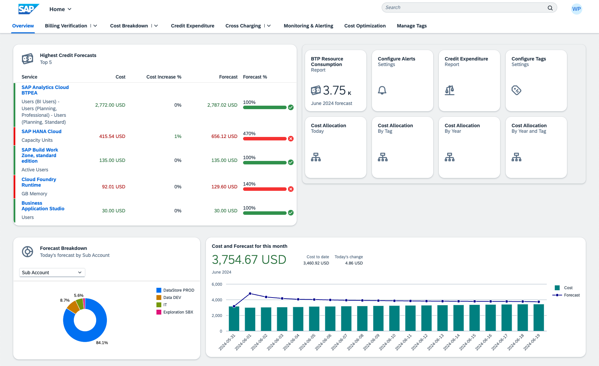

[](https://api.reuse.software/info/github.com/SAP-samples/btp-resource-consumption-monitor)

# BTP Resource Consumption Monitor

## Description

Application to monitor and alert on commercial and technical consumption of BTP CPEA/BTPEA services.

See also:

1. March 2024: [SAP Blog: Prototype: Keep Track of those BTP Credits](https://community.sap.com/t5/technology-blogs-by-sap/prototype-keep-track-of-those-btp-credits/ba-p/13626545).
2. June 2024: [SAP Blog: BTP FinOps: Keeping Track of your Credits](https://community.sap.com/t5/technology-blogs-by-sap/btp-finops-keeping-track-of-your-credits/ba-p/13737793).





***Disclaimer:*** *This tool is provided as-is and is not covered by SAP Support. This is not a replacement of the official billing documents you receive from SAP. The information provided by this tool is purely indicative.*

## Capabilities

- **Billing Verification**: Provides insights in the different services active in your account, their forecasts, and distribution over the different directories, sub accounts and spaces.
- **Cost Breakdown**: Analyzes costs based on the account structures across the different connected accounts.
- **Credit Expenditure**: Displays your contract and the credit consumption, together with estimations and billing difference verification.
- **Cross Charging**: Analyzes costs based on configured tags on multiple levels.
- **Monitoring & Alerting**: Configures different alerts to be triggered when costs, usage and forecasts change on a daily basis.
- **Cost Optimization**: Provides food for thought on how to control your spend and get the most out of your BTP investment.


## Requirements

You need to have access to a `Sub Account`, in which *Cloud Foundry* is enabled, and you have created a `Space`. ***Note***: the name of this `Space` can not contain a space (' ') but you can use underscores ('_') or hypens ('-').

The following **Subscriptions** are required to deploy and use this application:
- SAP HANA Cloud (you can re-use an existing instance. **Note**: this instance can sit in *any subaccount within the same region*)
- SAP Work Zone (Standard edition is sufficient. **Note**: this subscription should be in the *same subaccount* as where the CF application will be deployed)
- SAP Business Application Studio (**Note**: this subscription can sit in *any subaccount*)
<!-- - Your user needs to have either the `Global Account Viewer` or `Global Account Administrator` role *(TBC)* -->

The following **Entitlements** need to be available to use this application:
- Alert Notification: standard
- Authorization and Trust Management Service: application
- Destination service: lite
- HTML5 Application Repository Service: app-host
- Job Scheduling Service: standard
- SAP HANA Schemas & HDI Continers: hdi-shared
- Usage Data Management Service: reporting-ga-admin
- Application Logging Service: standard (optional service)

The following components are **optional but recommended** as an add-on:
- SAP Analytics Cloud version 2024.08+ (**Note:** this SAC tenant can reside *anywhere*, it doesn't have to sit in the same global account)

## Download and Installation

This solution contains 3 installable components:
1. A backend application (CAP Typescript) to be deployed to Cloud Foundry (CF)
2. *(optional)* An analytical package to be deployed to SAP Analytics Cloud (SAC)
3. A frontend package (content package) to be deployed to SAP Work Zone (WZ)

### 1. CF Application
In **Business Application Studio**, make sure to have a `Development Space` of kind `Full Stack Cloud Application` with the additional `Development Tools for SAP Build Work Zone` extension enabled. Alternatively, you can use Visual Studio Code or any other preferred IDE where NodeJs, [@sap/cds-dk](https://cap.cloud.sap/docs/get-started/jumpstart#_2-install-cap-s-cds-dk) and [mbt](https://github.com/SAP/cloud-mta-build-tool) is installed.

`Clone` this repository in your environment and open the project.

*Note:* You can use the application's default settings, or read through the rest of this document to identify the areas where you would like to use a different configuration. This relates to: default tags, available tags, multiple global accounts, currency conversions and using free tier.

#### Option A. Deploy with Alert Notification configuration (initial deployment; existing configuration will be overwritten):
***Important - First change the following code lines before continuing:***
- Configure your **email address** in the notifications configuration file [mtaext_notifications.mtaext](/cf/mtaext_notifications.mtaext#L19)

```cmd
# from the project root folder:
cd cf
npm install
mbt build
cf deploy ./mta_archives/btp-resource-consumption_2.0.2.mtar -e mtaext_notifications.mtaext
```

***Note:*** This deployment will trigger an **initial activation email** to your email address asking for your consent to receive further emails. Make sure to action this email to ensure you receive the notifications from this application!

#### Option B. Deploy without changing any Alert Notification configuration (incremental deployments):
```cmd
# from the project root folder:
cd cf
npm install
mbt build
cf deploy ./mta_archives/btp-resource-consumption_2.0.2.mtar
```

### 2. SAC Content

This component is optional but provides additional insights. It could act as the recommended *interface for cost owners* (after cross-charging) to consult their individual charges. In that case there is no need to provide them Work Zone access to the entire application but just to the focussed SAC Story.

The current content package requires at least **SAC version 2024.08**
<!-- ***Temporary note: The current content package requires SAC version 2024.13 or later. We are looking at options to lower this dependency to 2024.08*** -->

#### Step 1. Define connection
In order for the SAC dashboards to connect to your data, it needs a connection to your HDI container. The name of this connection has to be `BTPRCHDI`.

1. Navigate in the `BTP Cockpit` to your subaccount and space where you just deployed the application (above step). Open the `Instances` view.
2. Click on `btprc-db` to open the details of the HDI container module, and click on `btprc-db-key` to reveal its connection details. Take note of the following settings:
    - `host`
    - `user` (not hdi_user)
    - `password` (not hdi_password)
3. Now open your `SAC tenant` and navigate to `Connections`.
4. Create a new connection to `Live Data` from `SAP HANA`, and provide the following:
    - Name: `BTPRCHDI`
    - Connection Type: `SAP HANA Cloud`
    - Authentication Method: `User Name and Password` (default)
    - Host, User Name and Password

#### Step 2. Upload content
1. In your SAC tenant, navigate to `Transport`, `Import`.
2. Click on the upload button to upload the [SAC package file](./sac).
3. After uploading, refresh the list and open the uploaded package.
4. Validate the proposed settings and finally click `Import`.

#### Step 3. Allow App Integration
1. In your SAC tenant, navigate to `System`, `Administration`, `App Integration`.
2. In the section of `Trusted Origins`, add an entry to your Work Zone site to allow your site to embed the SAC Story. You can use wildcards (e.g. `https://*.launchpad.eu20.hana.ondemand.com`)

#### Step 4. Validate imported artifacts
Due to the export/import process of SAC, there might be misalignments between our development environment where the content was exported from, and your environment where you import it in. A quick validation can help in making sure there are no issues in accessing the story from the application:
- Navigate to the `Modeler` and try to open each of the 3 models. In case of a Schema error, remap the models to the correct Calculation View from your BTPRCHDI connection via the `Change Data Source` menu option.
- Navigate to the `Stories` section and try to open the story. In case of a user privilege error, refer to the 'Known Issues' section below.

#### Step 5. Get Story URL
1. In your SAC tenant, navigate to `Files`, `Public/BTPRC_FinOps` (or the folder name you chose in previous step).
2. Open the `BTP FinOps` story (whose data might look empty for now), and click `File`, `Share`.
3. Take note of the URL shown as it contains your **host**, **tenant** and **story id** in the following format: `https://<YOUR_HOST>.sapanalytics.cloud/sap/fpa/ui/tenants/<YOUR_TENANT>/bo/story/<YOUR_STORY>`.
4. Keep this screen open, as this information will be used to configure the Work Zone content (next module) correctly.


### 3. Work Zone Content

***Important - First change the following code lines before continuing:***
- Configure your **subaccount id** in business app configuration files of the multiple ui5 applications by searching for "<YOUR_SUBACCOUNT_GUID>" in each of the below files. Doing a search-and-replace should give you 8 matches:
    1. [Billing Differences app](./workzone/cdm/apps/billingdifferences.json#L85)
    2. [BTPRC Report app](./workzone/cdm/apps/btprcreport.json#L90)
    3. [Manage Alerts app](./workzone/cdm/apps/managealerts.json#L90)
    4. [Manage Tags app](./workzone/cdm/apps/managetags.json#L85)
    5. [Measures by Tags app](./workzone/cdm/apps/measuresbytags.json#L85)
    6. [Measures for Year by Tags app](./workzone/cdm/apps/measuresforyearbytags.json#L85)
    7. [Measures for Years app](./workzone/cdm/apps/measuresforyears.json#L85)
    8. [Measures Total app](./workzone/cdm/apps/measurestotal.json#L85)
- *(Only if you are activating the SAC content)* Configure your **SAC Story url** in SAC card configuration files of the multiple widgets by searching for "<YOUR_SAC_STORY_URL>" in each of the below files. Doing a search-and-replace should give you 4 matches. The resulting SAC URL **deviates slightly** from the URL shown in SAC, so be careful in composing it correctly. Your final URL (which is the same for all 4 files) should be: `https://<YOUR_HOST>.sapanalytics.cloud/sap/fpa/ui/tenants/<YOUR_TENANT>/app.html#/story2?shellMode=embed&/s2/<YOUR_STORY>/?url_api=true&pageBar=disable&view_id=story2`. Files to be changed:
    1. [SAC Measures by Tags](./workzone/cdm/cards/sac.measuresbytags/src/manifest.json#L33)
    2. [SAC Measures for Year by Tags](./workzone/cdm/cards/sac.measuresforyearbytags/src/manifest.json#L33)
    3. [SAC Technical Allocation](./workzone/cdm/cards/sac.technicalallocation/src/manifest.json#L33)
    4. [SAC Credit Projection](./workzone/cdm/cards/sac.creditprojection/src/manifest.json#L33)

#### Step 1. Build
```cmd
# from the project root folder:
cd workzone
npm install
npm run build
```

This will create a `/workzone/package.zip` file which you can download to your local machine to use in step 2 below.

#### Step 2. Deploy the package
In the **Work Zone Site Manager**, open the `Channel Manager` and:
1. Synchronize your HTML5 Repository by clicking on the `refresh icon`
2. Click on `+ New`, `Content Package` and upload the generated `/workzone/package.zip` file, specifying `btprc-srv` as Runtime Destination. You can keep the other default values.
3. The import will take up to 30 seconds to complete

#### Step 3. Configure your site
In the **Work Zone Site Manager**, open the `Site Directory` and:
1. Create a new site (or use the `default` one)
2. (optionally) Configure an alias by clicking on the 3-dots icon and select `Manage Site Alias`
3. Click on the *gear icon* to open the `Site Settings`, and click on `Edit`
4. In the `Display` section, change the `View Mode` to `Spaces and Pages - New Experience`
5. In the right-hand side `Assignments` panel, make sure that the following 2 roles are enabled by clicking on their `+ icon`:
    - BTP Resource Consumption Role
    - BTP Resource Consumption SAC add-on
6. Save and close


## Role Assignments
In the **BTP Cockpit**, go to the Security settings of your subaccount and assign the below 3 `Role Collections` to your user:
- `~btprc.cpkg_access_role` to access the Work Zone content (front-end)
- (optional) `~btprc.cpkg_sac_role` to access the SAC add-on Work Zone content (front-end)
- `BTPResourceConsumption Viewer` to access the CF Application (back-end)

In case you activated the SAC content as well, make sure that each user that will be using the solution also has a SAC user.

User who would *only* use the SAC interface do not need any of the role assignments and can access the SAC story directly.

## Access the application
In the **Work Zone Site Manager**, open the `Site Directory` and click on the *Go To Site icon* to open your site.

It is suggested to configure the application and modify the 'Forecasting Configuration' individually for each of the services to make sure the forecast is calculated correctly. Until this is set correctly, the forecasted costs might be unrealisticly high.

## Run Locally
To run the application locally, you need to bind to the cloud service instances and run the application in hybrid mode. 
```
# from the project root folder:
cd cf
npm install -g ts-node
cds bind -2 btprc-uas,btprc-db,btprc-dest
cds-ts watch --profile hybrid
```

Open your browser to http://localhost:4004 where you will find the relevant `Web Applications`.

**Tip:** This will connect to the HANA Cloud database. In case you want to use a local sqlite database for testing, run `cds deploy -2 sqlite`, and remove the binding to `btprc-db` from the `.cdsrc-private.json` file.

## Architecture


## Initial Data and Recurring Jobs
When started for the first time, the application creates multiple jobs in the Job Scheduling Service:
- `Default_UpdateDailyUsage`: a recurring job to retrieve the consumption information for that day. In its default configuration, this job will run every 3 hours (*/3 UTC). Typically, the Usage Data Management API provides new data points around 6am UTC but this can vary.
- `Default_UpdateMonthlyUsage`: a recurring job to retrieve the consumption information from the past month. In its default configuration, this job will run every 1st day of the month, at 1:00 AM and 3:00 AM UTC. It runs twice, in case the first run is not successful.
- `Default_UpdateHistoricUsage`: a one-time job which runs after creation of the job. It is used to retrieve the consumption information of that day + the past months (default: from October 2023, see [settings.ts](/cf/srv/settings.ts#L10)). This makes sure that after deploying the application you immediately have some information in the dashboards before the scheduled jobs run.

The initial data that this last job retrieves can be refreshed/extended from the UI: in the application open the `Data Management` menu and click on `Load historic data`. Here you can specify how far back you want to retrieve the consumption information.

The other menu option (`Load consumption for current month`) is exactly the same as what the first job runs every 3 hours, so it is not needed to be used and is mainly intented for testing purposes.

You can freely edit/change the created jobs, or create other jobs. When the application (re)starts it will re-create the jobs if they don't exist already, but it won't overwrite them if they do exist.

*Note:* Jobs have a default expected completion time of 15 seconds. Depending on the query, the application and/or API can take longer to process a request. In that case, the job monitor will classify the run as failed even though it ran successfully.

## Forecasting Configuration
Each commercial metric of a service has a `Forecasting Configuration`. The following settings are available:
- `Excluded`: the metric will not be forecasted/propagated. The current consumption for today is what is expected for the entire month. This should be used for 'stable services'.
    - examples: SAP Integration Suite tenants, SAP Business Application Studio users, ...
- `Time Linear`: the metric will be forecasted with a linear trend, based on time. The consumption will be divided by the current day in the month and multiplied by 30 to come to a full month's consumption. This should be used for services that have a steady consumption throughout the month.
    - examples: SAP HANA Cloud capacity units, Cloud Foundry GB memory, ...
- `Time Degressive`: the metric will be forecasted with a degressive/progressive trend, based on time. This is a variant of the linear approach, but you can give a `degression factor` to specify the decrease/increase in consumption through the month. This should be used for services that have a free allowance and charges only apply above this allowance (progressive), or for services that have a baseline consumption + some small uptake throughout the month (degressive)
    - Degression factor values:
        - < 1: the usage of the remaining days will be lower than the usage of the past days (degressive)
        - = 1: the usage of the remaining days will be similar to the usage of the past days (linear)
        - \> 1: the usage of the remaining days will be higher than the usage of the past days (progressive)
    - examples: SAP Integration Suite transactions (has free allowance), Mobile Services users (most users' first access will be early in the month), ...

The forecasting settings can be all reset to the default value (see [settings.ts](/cf/srv/settings.ts#L14)) from the UI: menu `Forecast Management: Revert all forecast settings to default`.

## Technical Allocation
Each commercial metric of a service has a `Technical Allocation` configuration. This caters for cost distribution to space level.

The SAP Business Technology Platform keeps track of *costs* either on Sub Account level (for Subscriptions) or Service level (for Service Instances). Only *usage* information (e.g. GB memory) is reported on a lower level (Space level). In order to be able to assign (distribute) costs to this level as well, we need to use a `Technical Metric` counterpart whose usage information will be used as a distribution key.

Example: In a given **Sub Account** your Cloud Foundry Runtime reports a *Commercial Metric* of USD 100 costs for a 2 GB Memory usage. In this Sub Account, you have 3 **Spaces**, each using a part of this Cloud Foundry Runtime and as such generating *Technical Metrics*: Space A using 0.5 GB, Space B using 0.9 GB and Space C using 0.6 GB. If we configure the `GB Memory` *Technical Metric* to be our distribution key for the *Commercial Metric*, then Space A will receive an allocation of USD 25, Space B will receive USD 45 and Space C will receive USD 30. Each Space will receive this allocation, together with a **Service (alloc.)** entry to denote the service contributing to the Space cost.

The outcome is visualized in the `Billing Verification > Technical Allocation Dashboard` page (a SAC report), as well as in the `Cost Breakdown` pages. Note that this downward allocation does not *replace* or *remove* the costs on Sub Account or Service level. These will remain.

At this point in time it is only possible to use technical metric usage data of the same service as distribution key, but other methods could be explored via additional development.

If you do not wish to use this feature, you can switch it off in [settings.ts](/cf/srv/settings.ts#L37).

## Configuring Tags
The Tag Manager is used to assign tags. If a given level (Directory, Sub Account, Space, ...) is anotated with a tag, any costs that are generated on that level are reported for that tag. `Managed Tags` can have a percentage-wise distribution, whereas `Custom Tags` receive always 100% of the costs of the tagged item.

**Important:** Given that tags receive all costs of the level they are associated with, it is possible to mistakenly double-up costs when tagging *sub-items* as well as *parent-items* with the same tag. Make sure to only have a single level of tagging in each lineage to the root `Customer` element for each tag. Levels can be mixed however if they don't overlap in the hierarchy tree (e.g. Sub Account A tags on Service level, whereas Sub Account B tags on Sub Account level), or if the tag name itself is different (e.g. Sub Account A = 'Cost Center: 100', and Service X in Sub Account A = 'Line of Business: HR').

Up to 10 `Managed Tags` can be configured. 2 are configured by default: **Line of Business** and **Cost Center**. In order to add/change the available managed tags:
1. Update the csv data for `ManagedTagNames` in [db-CodeLists.csv](./cf/db/data/db-CodeLists.csv#L72). This will steer the available options in the dropdown selection in the Configure Tags application.
2. Update the mapping in [settings.ts](./cf/srv/settings.ts#L197). This will filter the tags to show in columns 1-10 in the Configure Tags list view.
3. Update the titles in [schema.cds](./cf/db/schema.cds#L315). This will steer the titles of the columns in the Configure Tags list view.
4. In case you enable more than 2 managed tags, you will have to 'un-hide' additional columns by setting the `@UI.Hidden` value to `false` in the [annotations](./cf/app/managetags/annotations.cds#L114) file, for each of the *tagTextManaged(x)* columns you want to use.

## Switching/Multiple Global Accounts
The application can be connected to a different/multiple Global Accounts to monitor their consumption instead of/in addition to the Global Account where the application is deployed in (default).

To do so:
- Manually create an instance of the `Usage Data Management Service` service of plan `reporting-ga-admin` in the other Global Account. Create a `Service Key` on that service instance, and copy its contents.
- In the Global Account where the application is deployed, create a new `User Provided Service` in which you paste the service key contents. The *name* of this user provided service has to **start with** `btprc-uas` (use e.g. `btprc-uas-ups-account2`).
- Adapt the `mta.yaml` on lines 35, 36 and 280, 287 to swap/add the bound standard service instance for the user-provided instance.
- In case of multiple Global Accounts the solution will display a `Breakdown by Global Account`. To enable, activate the 'multi global account mode' in [settings.ts](./cf/srv/settings.ts#L7).

**Important:** In case of using multiple Global Accounts, take note of the currencies of the accounts. The solution can only work correctly if the currencies are aligned. If different currencies are used in the different Global Accounts, enable currency conversions in [settings.ts](./cf/srv/settings.ts#L14): set a final/unified currency as `target` and provide the exchange rates of the other currencies. Make sure to set the `active` flag to `true` to enable the conversion.

## Using Free Tier
For demo and test purposes it is possible to implement this solution using Free Tier services. Be aware there are restrictions when using the Free Tier service plans.

- Subscriptions:
    - SAP HANA Cloud: free tier plan is available, but note your database will be stopped every night causing jobs to fail. Restart your database in the mornings. See [restrictions](https://help.sap.com/docs/hana-cloud/sap-hana-cloud-administration-guide/sap-hana-database-license#free-tier).
    - SAP Work Zone, standard edition: free tier plan is available and can be used. See [restrictions](https://help.sap.com/docs/build-work-zone-standard-edition/sap-build-work-zone-standard-edition/using-account-with-free-service-plan).
    - SAP Business Application Studio: free tier plan is available and can be used. See [restrictions](https://help.sap.com/docs/bas/sap-business-application-studio/application-plans).

- Resources:
    - Cloud Foundry runtime: free tier plan is available and can be used. Create your CF Organisation with the 'free' option before deploying the application.
    - SAP Alert Notification service: free tier plan is available and can be used. Switch your MTA to plan 'free' instead of 'standard' [here](/cf/mta.yaml#L186).
    - SAP Application Logging service: there is no free plan, but this is an optional service, so you can just remove it from your MTA, both [here](/cf/mta.yaml#L34) and [here](/cf/mta.yaml#L240).
    - SAP Job Scheduling service: no free plan available. For an indicative pricing, see [here](https://discovery-center.cloud.sap/serviceCatalog/job-scheduling-service?region=all&tab=service_plan).

## Known Issues
- **Dynamic Tile**: In case the dynamic tile of the Report application does not show your forecasted CPEA credit for this month (but shows 3 dots instead), you will need to manually create a system mapping. In the `Work Zone Site Manager`, navigate to the `Settings` menu and go to `Alias Mapping`. Add a new alias with the following settings: Aliases = `sid(BTPRC.CPKG)` and Runtime Destination = `btprc-srv`. If this mapping already exists and the error is still present, `edit` and `save` this mapping without making changes to re-trigger it.
- **Cachebuster error 500**: In case your applications do not open from the launchpad because of a failed call to `/cachebusterTokens.json`, you can correct this from the `Work Zone Channel Manager`. Use the `Update content` button of the `HTML5 Apps` entry **2 times** (refresh the content twice consecutively), which will create the cache records in the background and then your apps should open correctly.
- **SAC "Can't read the view: BTPRC_MONITORING:..."**: It is possible that even after you remapped all 3 models to the correct connection, opening the story keeps on displaying this error while still showing the data at the same time. To get rid of this (un-needed) error, open your SAC story, click on `edit` and `save`. This should remove the error the next time you open the story.
- **SAC "You have no authorization to the model" or "Insufficient Privileges"**: In case the SAC story can not load because of an error stating "You have no authorization to the model", and opening the SAC model directly gives "Insufficient privileges", use the `HANA Cloud Cockpit` to assign the missing Object Privileges to the user used to connect to the HDI. A known suspect here is the `_SYS_BI::BIMC_PROPERTIES` table which needs `SELECT` privileges.

## How to obtain support
[Create an issue](https://github.com/SAP-samples/btp-resource-consumption-monitor/issues) in this repository if you find a bug or have questions about the content.
 
For additional support, [ask a question in SAP Community](https://community.sap.com/t5/forums/postpage/choose-node/true/board-id/application-developmentforum-board).

## Contributing
If you wish to contribute code, offer fixes or improvements, please send a pull request. Due to legal reasons, contributors will be asked to accept a DCO when they create the first pull request to this project. This happens in an automated fashion during the submission process. SAP uses [the standard DCO text of the Linux Foundation](https://developercertificate.org/).

## Code of Conduct

See [Our Code of Conduct](CODE_OF_CONDUCT.md).

## License
Copyright (c) 2024 SAP SE or an SAP affiliate company. All rights reserved. This project is licensed under the Apache Software License, version 2.0 except as noted otherwise in the [LICENSE](LICENSE) file.
